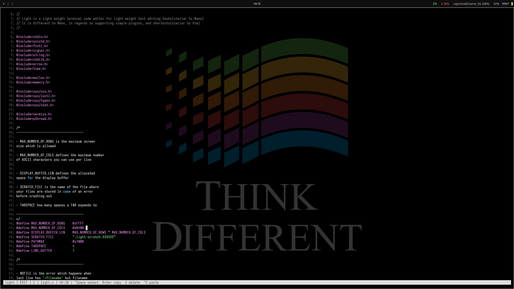

```code
I wrote light for my own use, and am sharing it here for people interested in how text editors work.

light is a text-editor, which is extremely light(under 45kB), has a modest amount of features(Copy+Paste+Navigation,etc.), and
makes writing and editing code simple.
```



```code
Things you might need to know

light buffers code, and displays it, and reads for input at the
console asynchronously. The main controls are intuitive enough for
the new user. Up, down, left, right do what you expect them to
mostly. 

But light supports plugins, and shortcuts.
--> plugins are anything that change the DISPLAY_BUFFER[][], which is the 
main buffer maintained to capture input/user code, and are of
the form:

plugin_example_do_this(char* result, char* buffer, int i);
-> although a plugin may decide to ignore any such argument

where: result = the string that is to be altered based on buffer
	which is the current string (DISPLAY_BUFFER[CURRENT_ROW])
	         i = CURRENT_ROW_NUMBER

plugins are called everytime input is read at the console
For example, 
.	line numbers are displayed using a plugin, like so:
.	plugin_line_number(...);
.	text highlighting is also a normal plugin, like so:
.  plugin_highlight(...);

--> shortcuts are anything that change attributes of the DISPLAY_BUFFER
based on user-input, and are of the form:

shortcut_some_do_this(char ch);
-> shortcuts are always initiated with Ctrl character

shortcuts, unlike plugins are called when their Ctrl + <Char> 
tuple is received
For example,
.   Ctrl + l adds a line below your current ROW no matter your
position within that ROW unlike the normal Enter key
.   shortcut_add_line_below(...);
.   Ctrl + D removes the current line
.   shortcut_delete_curr_line(..);
.   Ctrl + X clears the current line
.   shortcut_clear_curr_line(..);
.   Ctrl + E goes to End Of Line
.   shortcut_goto_end_ROW(..);
.   Ctrl + B goes to beginning of line
.   shortcut_goto_beginning(..);
.   Ctrl + W goes to line number 0
.   shortcut_goto_line0(..);
.   Ctrl + A goes to last line
.   shortcut_goto_last_line(..);
.   Ctrl + N saves (and is the only shortcut that writes the file)
.   Ctrl + Z undoes the last edit; press it again to toggle the edit back
.   Ctrl + G duplicates the current line
.   Ctrl + K cuts the current line; Ctrl + Y pastes it below
.   Ctrl + U removes up to four leading spaces
.   Ctrl + P deletes the character under the cursor
.   Ctrl + Q quits, asking first when the buffer has unsaved changes

An unnamed scratch buffer must first use `=filename`; light will not silently
invent a destination when you answer the exit prompt.

Type `:<row-number>` on a line and press Enter to jump there. The command
line disappears after the jump. In a new scratch buffer, type `=<filename>`
and press Enter to choose its filename, then use Ctrl + N when you want to
write it.

The display plugins add C syntax colors, a highlighted cursor, colored line
numbers, and a bottom status bar. These plugins only affect the terminal;
ANSI color sequences are never stored in your file.

Syntax highlighting follows the filename:
Syntax highlighting is not complete, and is meant only for simple highlight effects.

.   `.c`, `.cpp`, and `.cu` use C-family keywords, strings, comments, numbers,
    and preprocessor highlighting
.   `.py` uses Python keywords, strings, comments, numbers, and decorator
    highlighting
.   Other filenames stay plain text

Keyboard navigation:

.   Arrow keys move one row or column with incremental rendering
.   Ctrl + Left and Ctrl + Right jump by word
.   Home and End jump to the beginning or end of the row
.   Page Up and Page Down move by one visible viewport
.   Ctrl + Up and Ctrl + Down also move by one visible viewport

Mouse controls:

.   Click to place light's editing cursor
.   Mouse dragging is not captured by light

Keyboard selection and clipboard:

.   Ctrl + Space starts selection at the cursor
.   Arrow keys extend the selection
.   Ctrl + Space again leaves selection mode without changing text
.   Enter copies the selection and leaves selection mode
.   d deletes the selection and leaves selection mode
.   Ctrl + V pastes while in normal editing mode

Copied text is kept in light's clipboard and also offered to compatible
terminal clipboards through OSC 52.

light captures terminal control characters while it is running, so Ctrl + Z,
Ctrl + V, and Ctrl + Q reliably reach editor shortcuts. The original
terminal settings and click mode are restored on exit.

Build and install:

.   `make` builds `./light`
.   `sudo make install` installs it as `/usr/local/bin/light`
.   `PREFIX=/somewhere make install` selects another installation prefix

Adding shortcuts, and plugins, is simple
God loves simple things heartfully.
```
