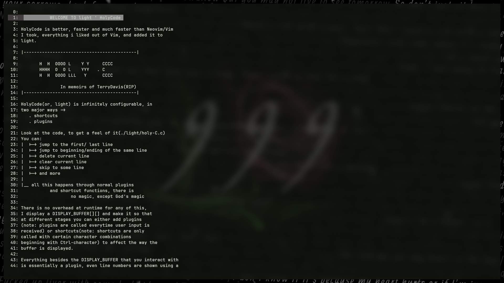

`code
light ' HolyCode 

[.] Praise God
[.] If Vim/Neovim is Rust, light/HolyC is C.
[.] Designed to get work done, with no checks and restrictions.
[.] You can look at the holy-code(light.holy-C.c) distributed with
this repository, to learn about the axioms of light ' HolyCode.
[.] There is almost no runtime overhead for the editor
[.] Praise God
`

Things you might need to know

light buffers code, and displays it, and reads for input at the
console asynchronously. The main controls are intuitive enough for
the new user. Up, down, left, right do what you expect them to
mostly. The Vim/Neovim user, might be surprised, there are no
modes in light ' holyC(or you may say, everything happens in INSERT mode).

But light ' HolyCode supports plugins, and shortcuts.
--> plugins are anything that change the DISPLAY_BUFFER[][], which is the 
main buffer maintained to capture input/user code, and are of
the form:

plugin_example_do_this(char* result, char* buffer, int i);
-> although a plugin may decide to ignore any such argument

where: result = the string that is to be altered based on buffer
	which is the current string (DISPLAY_BUFFER[CURRENT_ROW])
	         i = CURRENT_ROW_NUMBER

plugins are called everytime input is read at the console
For example, 
.	line numbers are displayed using a plugin, like so:
.	plugin_line_number(...);
.	text highlighting is also a normal plugin, like so:
.  plugin_highlight(...);

--> shortcuts are anything that change attributes of the DISPLAY_BUFFER
based on user-input, and are of the form:

shortcut_some_do_this(char ch);
-> shortcuts are always initiated with Ctrl character

shortcuts, unlike plugins are called when their Ctrl + <Char> 
tuple is received
For example,
.   Ctrl + l adds a line below your current ROW no matter your
position within that ROW unlike the normal Enter key
.   shortcut_add_line_below(...);
.   Ctrl + D removes the current line
.   shortcut_delete_curr_line(..);
.   Ctrl + X clears the current line
.   shortcut_clear_curr_line(..);
.   Ctrl + E goes to End Of Line
.   shortcut_goto_end_ROW(..);
.   Ctrl + B goes to beginning of line
.   shortcut_goto_beginning(..);
.   Ctrl + W goes to line number 0
.   shortcut_goto_line0(..);
.   Ctrl + A goes to last line
.   shortcut_goto_last_line(..);

Adding shortcuts, and plugins, is simple
God loves simple things heartfully.

RIP Terry Davis
Praise God
